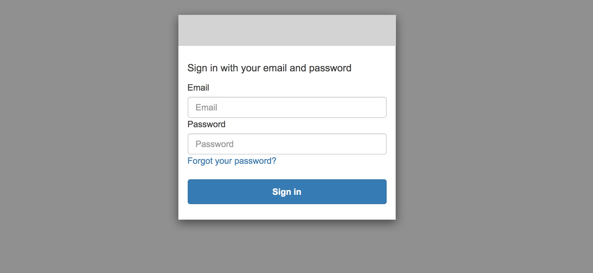
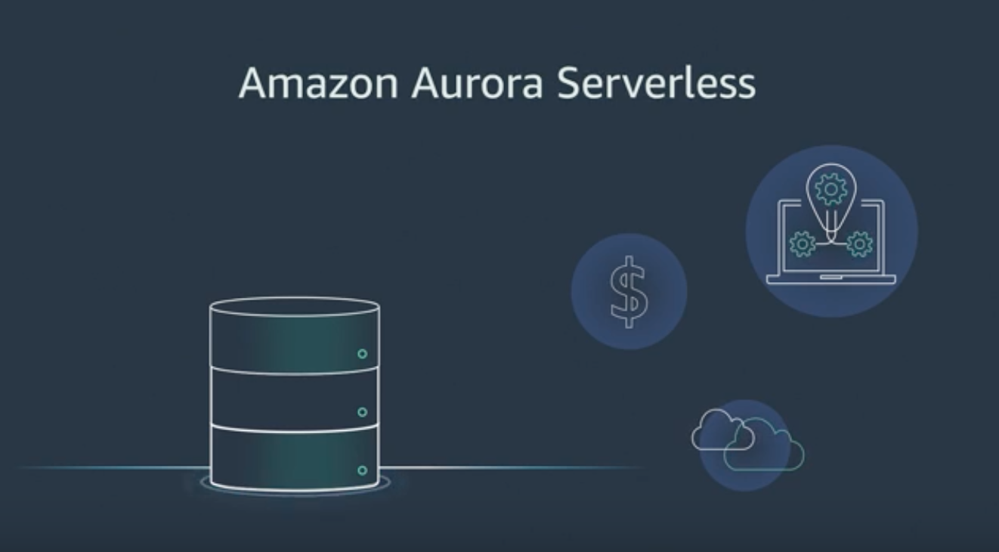

######
#Private Netflix
######

 a video on demand service for documentation


#How to save money on EC2
- Replace your manually created Autoscaling Group wiht a Elastigroup from SpotInst. 
	- [https://spotinst.com/](https://spotinst.com/)
	-  


#Your defalut login screen:



* To get access, contact your system admin....because new user sign-up may be restricted or disabled.  


#How to upload your own videos:
* Be aware that Streama can provide video is different formats, but the format you provide is of Critical importance to the viewers browser.  *mp4* files are the modern popular format. 

1. Browse to the video upload page here: 

 - TBS
2. Upload a file to the S3 bucket with a name that has no spaces. 
 - Example: myvideo.mov
3. Navigate to the Video Manager page in Streama
4. Add your video to the system using the "select a file" option
5. After the video is added, be sure to add meta informtion for the video
6. [Console Recorder](https://chrome.google.com/webstore/detail/console-recorder-for-aws/ganlhgooidfbijjidcpkeaohjnkeicba/related?hl=en)
6. .....TBD
 


#Deployment Pipeline Setup and Usage:


Setup

```
chmod +x streama
export PATH=$PATH:./
streama --help

```

Usage

```

    USAGE: streama [OPTIONS] 

    OPTIONS

	-h     Dispplay this help dialog
	-p     Displays the awsstudygurus tool variables 
	         (varies based on branch)

	-d     Runs with defaults (not yet implemented)
	-r     Forces a reset (not yet implemented)

	-dp    Creates the Cloudformation stack for the Deployment pipeline
	         The Deployment pipeline deploys the app code and 
	         must be created first
	-da    Pushes the application code to the origin for the Deployment pipeline
	         The Deployment pipeline must be created first.  Automation 
	         for the AWS pipeline must be setup using the BitBucket repo plugin
	         https://marketplace.atlassian.com/apps/1211351/repository-mirror-plugin-for-bitbucket?hosting=server&tab=overview
	         https://github.com/ef-labs/stash-hook-mirror/wiki

	-delp  Deletes the Cloudformation stack and related resources for the Deployment pipeline
	-dela  Deletes the Cloudformation stacks and related resources for the Application


	--help 		    Same as -h
	--printvariables    Same as -p
	--deploy_pipeline   Same as -dp
	--deploy_app 	    Same as -da
	--destroy_pipeline  Same as -delp
	--destroy_app	    Same as -dela
	--default 	    not yet implemented
	--reset  	    not yet implemented


```


<br/>
<br/>
<br/>
<br/>


----------------------------------------------------------------------------------------------------------------------------


#Your AMI Pipeline diagram:


#Your Serverless database:
[Amazon Aurora] (https://aws.amazon.com/rds/aurora/serverless/)

[  ](https://www.youtube.com/watch?time_continue=3&v=IwyOyGs69N4)

#Notes:
What is Video on Demand? 

- [https://en.wikipedia.org/wiki/Video_on_demand](https://en.wikipedia.org/wiki/Video_on_demand)
What is Netflix? 

- [https://en.wikipedia.org/wiki/Netflix](https://en.wikipedia.org/wiki/Netflix) 

- Original Code for Streama
- [https://github.com/streamaserver/streama](https://github.com/streamaserver/streama)
- Please give a Positive yelp review if you like this service :-) 
	- This helps avoid from spending thou$ands of dollars on a paid Video on Demand system
- Mother, where do the AMIs come from? 
	- Github [ami-builder-packer](https://github.com/awslabs/ami-builder-packer) 
- .....more to come


